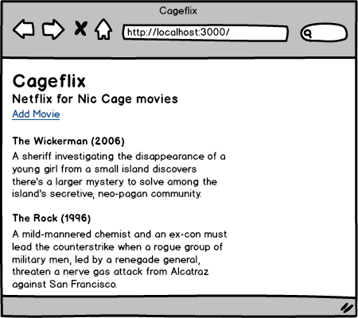
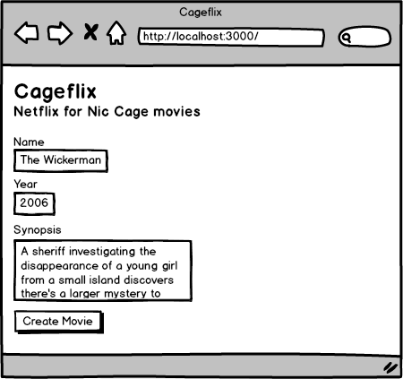
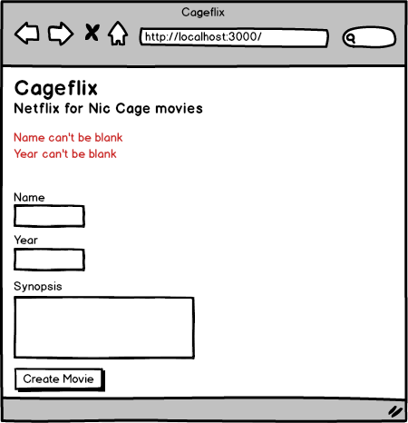
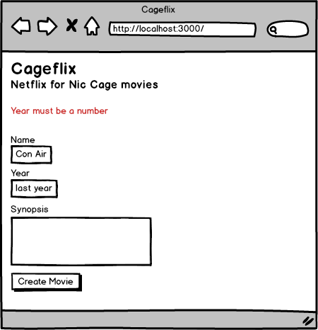

# Week 12 Assessment

We all know that when it comes to building a product, finding an underserved niche is key.
While Netflix is great general purpose solution to streaming movies online, what about
those that only want to watch Nic Cage movies?

Introducing Cageflix.

In this assessment we will start building out our world-changing idea by allowing people
to add movies to our Cageflix database.

## Project

Create a new Tracker project and upload the `stories.csv` file. Work on one story at a time
and complete each story before moving on to the next one! Reference the mockups below for
clarification on stories.

## Mockups

